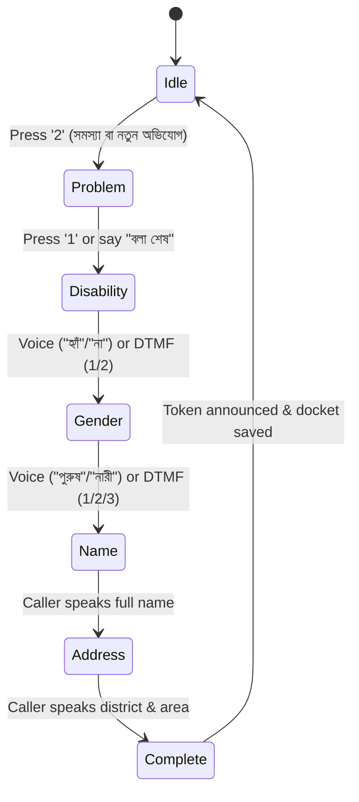

# Case Intake Chaining & Multi-Input System Architecture

This document details the multi-input chaining architecture for IVR Option 2 (**"সমস্যা বা নতুন অভিযোগ"**), key configuration parameters, files modified, and exact instructions for troubleshooting or rolling back changes.

---

## 1. System Overview & Flow Sequence

When a caller selects IVR Option 2 (or says "সমস্যা বা নতুন অভিযোগ"), the agent initiates a guided 5-step intake chain. Each step awaits user input (via natural voice or dialpad DTMF), gives an immediate AI acknowledgment, and transitions cleanly to the next question.



### Detailed Step Behaviors:

1. **Step 1: Problem Statement (`intakeStep = "problem"`)**
   - **AI Prompt**: `"জি, আমি শুনছি। আপনার পুরো আইনি সমস্যাটি বিস্তারিত বলুন। বলা শেষ হলে ডায়ালপ্যাডের ১ চাপুন।"`
   - **Pause Protection**: Automated silence cut-off (LLM turn timer) is inhibited during this step so callers can pause to think without being cut off mid-sentence.
   - **Completion Trigger**: Pressing keypad `1` (or saying "বলা শেষ") calls `advanceFromProblemStep()`.
   - **Category Inference**: The system analyzes keywords to infer legal category (e.g. `land_property`, `domestic_violence`, `criminal_defense`, `labor_dispute`, `cyber_harassment`).

2. **Step 2: Disability Status (`intakeStep = "disability"`)**
   - **AI Prompt**: `"আপনার সমস্যাটি নথিভুক্ত করা হয়েছে। আপনার কি কোনো শারীরিক বা বিশেষ প্রতিবন্ধকতা রয়েছে? হ্যাঁ অথবা না বলুন।"`
   - **Voice Input**: Captures single-syllable short words `"হ্যাঁ"` (`true`) or `"না"` (`false`).
   - **Dialpad Input**: Button `1` = হ্যাঁ, Button `2` = না.

3. **Step 3: Gender (`intakeStep = "gender"`)**
   - **AI Prompt**: `"তথ্যটি সংরক্ষিত হয়েছে। আপনার লিঙ্গ কী? পুরুষ, নারী, নাকি অন্যান্য বলুন।"`
   - **Voice Input**: `"পুরুষ"`, `"নারী"`, `"অন্যান্য"` (and synonyms: ছেলে, মহিলা, মেয়ে, ইত্যাদি).
   - **Dialpad Input**: Button `1` = পুরুষ, Button `2` = নারী, Button `3` = অন্যান্য.

4. **Step 4: Full Name (`intakeStep = "name"`)**
   - **AI Prompt**: `"ধন্যবাদ। এবার আপনার পূর্ণ নামটি বলুন।"`
   - **Cleaning Logic**: Strips conversational speech prefixes (`"আমার নাম"`, `"আমি"`) and conversational verbs (`"বলছি"`, `"বলছিলাম"`), while preserving legitimate surnames/honorifics (e.g., `"ফাতেমা বেগম"`, `"করিম উদ্দিন"`).

5. **Step 5: District & Area (`intakeStep = "address"`)**
   - **AI Prompt**: `"ধন্যবাদ [জনাব/জনাবা নাম]। আপনার বর্তমান ঠিকানা ও জেলার নাম বলুন।"`
   - **Honorific**: Dynamically uses `"জনাবা"` if gender is female, or `"জনাব"` otherwise.
   - **Extraction**: Matches against Bangladesh's 64 official administrative districts while retaining the specific area or thana (e.g., "মিরপুর ১০, ঢাকা").

6. **Finalization (`intakeStep = "complete"`)**
   - **Token Generation**: Generates official token `DLAS-2025-XXXX`.
   - **TTS Prompt**: `"আপনার আইনি অভিযোগ ও তথ্যাবলী সফলভাবে নথিভুক্ত করা হয়েছে। আপনার কেস ডকেট নম্বর DLAS-2025-XXXX। জাতীয় আইনগত সহায়তা প্রদান সংস্থা থেকে আমাদের প্যানেল আইনজীবী দ্রুত আপনার সাথে যোগাযোগ করবেন। আপনাকে ধন্যবাদ।"`
   - **Sync**: Automatically persists the updated fields to `/api/agent/docket`.

---

## 2. Core Fixes for Short-Word Dropping ("হ্যাঁ" / "না")

Previously, crisp single-syllable Bengali words like "হ্যাঁ" (ha) or "না" (na) were being dropped. Two fundamental root causes were identified and fixed:

### A. Turn Phase State Machine Barge-In Word Count
- **File**: `lib/voice-sdk/direct/direct_session.ts`
- **Change**: `new TurnPhaseStateMachine(1)` (was `2`).
- **Explanation**: `TurnPhaseStateMachine` previously enforced `minBargeInWords = 2`. When a caller said a single word like `"হ্যাঁ"`, `wordCount >= 2` was false, and the turn was dropped as ambient acoustic noise. Changing the threshold to `1` allows single-syllable responses to register immediately.

### B. VAD Fast Attack Calibration
- **File**: `lib/voice-sdk/direct/vad.ts`
- **Change**:
  - `minSpeechFrames: 2` (was `3` frames; reduced detection latency from ~50ms to ~30-35ms).
  - `speechProbabilityThreshold: 0.62` (was `0.70`).
  - `minVolume: 0.0025` (was `0.0035`).
- **Explanation**: Vocal bursts for "হ্যাঁ" or "না" are short. Relaxing speech probability and volume threshold ensures the VAD triggers `SpeechStart` without requiring a prolonged vowel.

---

## 3. Files Modified & Key Functions

| File | Purpose & Key Additions |
| :--- | :--- |
| `lib/voice-sdk/direct/direct_session.ts` | Intake state machine (`startCaseIntakeChain`, `advanceFromProblemStep`, `handleIntakeDisabilityInput`, `handleIntakeGenderInput`, `handleIntakeNameInput`, `handleIntakeAddressInput`, `finalizeCaseIntake`), Bengali phonetic parsers (`parseBengaliYesNo`, `parseBengaliGender`, `cleanBengaliName`, `extractDistrict`, `inferLegalCategory`), and dual-modal routing in `sendUserMessage`. |
| `lib/voice-sdk/direct/vad.ts` | Calibrated `DEFAULT_VAD_CONFIG` for fast-attack short-syllable detection. |
| `lib/voice-sdk/types.ts` | Added `intake_step_changed` event type to `SdkEvent`. |
| `hooks/use-voice-session.ts` | Exposed `intakeStep` and `intakeData` in hook return type. |
| `lib/agent/memory/docket-store.ts` | Added `hasDisability?: boolean \| null` and `gender?: string \| null` to `CaseDocket`. |
| `app/api/agent/docket/route.ts` | Added `POST` handler for client-side docket memory syncing. |
| `app/page.tsx` | Visual Stepper header, dynamic dialpad button labels/highlights (1: হ্যাঁ / পুরুষ, 2: না / নারী), and live docket card displaying Gender & Disability Priority badge. |

---

## 4. Verification & Testing Scripts

Two Playwright automated verification scripts are located in `scripts/`:

1. **`scripts/verify_intake_chain.mjs`**:
   - Tests: Keypad 2 -> Problem speech -> Keypad 1 -> "না" -> "পুরুষ" -> "আব্দুল করিম" -> "মিরপুর, ঢাকা".
   - Run command:
     ```bash
     node scripts/verify_intake_chain.mjs
     ```

2. **`scripts/verify_dialpad_intake.mjs`**:
   - Tests: Keypad 2 -> Problem speech -> Keypad 1 -> Short word "হ্যাঁ" -> "নারী" -> "ফাতেমা বেগম" -> "চট্টগ্রাম সদর".
   - Run command:
     ```bash
     node scripts/verify_dialpad_intake.mjs
     ```

---

## 5. Rollback & Reversion Guide

If you need to roll back or modify this implementation in the future:

### Option A: Instant Cloudflare Workers Rollback (Zero Code Change)
Cloudflare keeps versioned deployments. You can instantly revert production to the prior deployment:

```bash
# View list of deployment versions
npx wrangler deployments list

# Rollback to the previous deployment version
npx wrangler rollback [PREVIOUS_DEPLOYMENT_ID]
```

*Note: The deployment version ID prior to this intake chaining update was `311a0ec7-0c01-434d-8beb-34071d7d5ba0`.*

### Option B: Disabling Intake Chaining in Code (Return to Freeform LLM)
If you want IVR Keypad Option 2 to route directly to the standard conversational LLM rather than the 5-step intake chain:

1. Open `lib/voice-sdk/direct/direct_session.ts`.
2. Locate `sendUserMessage(text: string)`:
   ```typescript
   // To revert, change this check:
   if (normalized === "2" || normalized === "২" || normalized.includes("অভিযোগ")) {
     this.startCaseIntakeChain();
     return;
   }
   ```
   Replace `this.startCaseIntakeChain(); return;` with:
   ```typescript
   // Fall back to general LLM turn
   this.turnState.forceListening();
   void this.executeLlmTurn(text);
   ```
3. Rebuild and deploy:
   ```bash
   npx @opennextjs/cloudflare build
   npx wrangler deploy
   ```

### Option C: Reverting VAD / TurnPhase Thresholds
If background noise starts triggering unwanted barge-ins in noisy environments:
1. In `lib/voice-sdk/direct/direct_session.ts`:
   - Change `new TurnPhaseStateMachine(1)` back to `new TurnPhaseStateMachine(2)`.
2. In `lib/voice-sdk/direct/vad.ts`:
   - Change `minSpeechFrames: 2` back to `minSpeechFrames: 3`.
   - Change `speechProbabilityThreshold: 0.62` back to `0.70`.

---

## 6. Government Portal Integration & Illiterate Citizen Voice UX

### Architecture:
1. **Official Landing Page (`components/portal-view.tsx`)**:
   - Integrated full government portal design from `Landing Pgae/bangladesh-legal-portal`.
   - Features: Top government strip, brand header, notice ticker, hero section, quick services, 24/7 emergency helplines (999, 109, 1098, 16699), mediation booking form, 64-district panel lawyers directory, and 5-step application wizard.

2. **Illiterate & Non-Technical Accessibility Callout**:
   - Citizens who cannot read or write are guided directly to the voice assistant:
     - 🎙️ *"পড়তে বা লিখতে পারেন না? কোনো সমস্যা নেই! সরাসরি বাংলায় মুখে বলুন।"*
     - Large animated pulsing call button: `📞 ১৬৬৯৯-এ এখনই কথা বলুন (১০০% বিনামূল্যে)`.
     - Zero form filling or typing required.

3. **Softphone Popup Modal (`components/softphone-modal.tsx`) & State Management**:
   - Clicking any "১৬৬৯৯" button across the portal opens an accessible popup softphone window.
   - Automatically initiates the call on open for effortless 1-tap operation.
   - Includes large-button Call / Hangup controls, audio wave visualizer, Case Intake Stepper, and dual-modal smart dialpad.
   - **Persistent Floating Call Pill**: If the user minimizes the softphone modal while a call is active, an active call pill floats at the bottom (`🟢 ১৬৬৯৯ কল চলছে • উইন্ডো খুলুন • কেটে দিন`), preventing accidental call dropouts.

